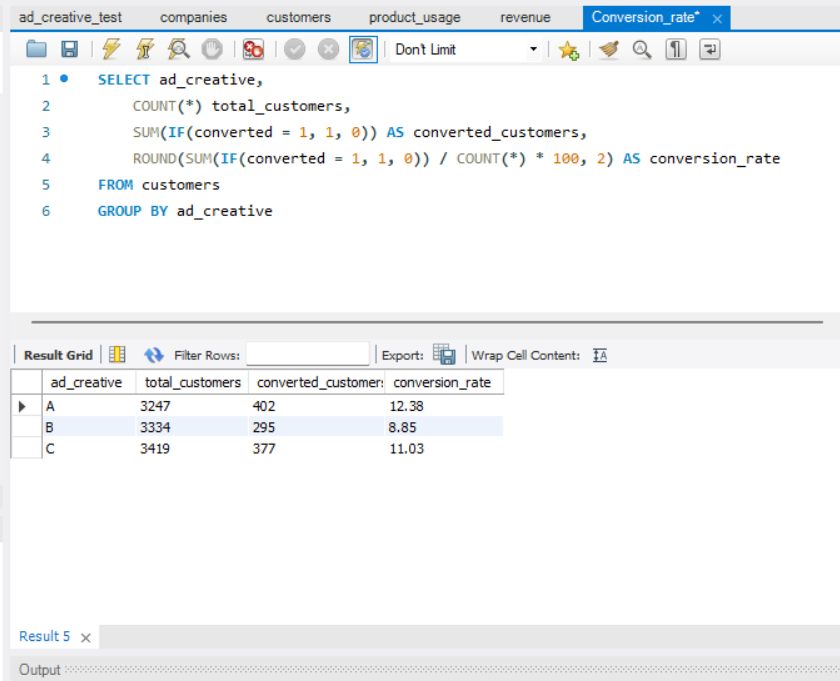
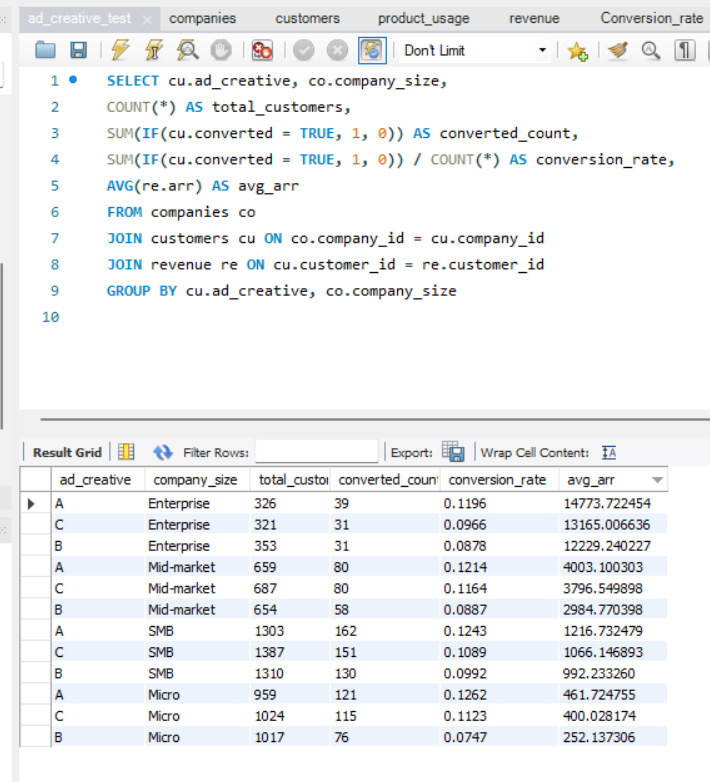

# TalentFlow A/B Test — Full Documentation

**Author:** Tal Lezerovich · **Stack:** MySQL · Python (pandas, SciPy) · matplotlib/seaborn

This document walks through the complete analysis: the business question, the SQL behind each result, the statistical validation, and the recommendation. For the executive summary, see the [README](README.md).

---

## Table of Contents

1. [Project Overview](#1-project-overview)
2. [Methodology](#2-methodology)
3. [SQL Analysis](#3-sql-analysis)
4. [Visualizations](#4-visualizations)
5. [Statistical Validation](#5-statistical-validation)
6. [Findings & Recommendation](#6-findings--recommendation)
7. [Limitations](#7-limitations)
8. [Future Work](#8-future-work)

---

## 1. Project Overview

**Question:** Which ad creative (A, B, or C) drives the highest conversion rate and attracts the most valuable customers?

**Why it matters:** For a growing recruitment SaaS, customer acquisition cost (CAC) and customer quality directly drive unit economics. A 3–4 point swing in conversion rate compounds into millions in revenue across the funnel, so knowing which creative resonates — and with which segments — directly informs budget allocation.

**Scope:** 10,000 customers acquired across three ad creatives during a 30-day campaign, segmented by company size and analyzed for conversion and revenue (ARR).

| Creative | Hook | Value proposition |
|:--------:|:-----|:------------------|
| **A** | *"Hire Faster"* | Speed, automation, lower time-to-hire |
| **B** | *"Hire Better"* | Candidate quality, cultural fit |
| **C** | *"Scale Your Hiring"* | Infrastructure for growing teams |

---

## 2. Methodology

**Research questions**

1. Which creative achieves the highest conversion rate overall?
2. How does performance vary by company size?
3. Are the observed differences statistically significant, or random?
4. Which creative attracts higher-value (higher-ARR) customers?

**Approach**

- **Descriptive analysis** — conversion rates by creative and by segment (SQL).
- **Statistical testing** — chi-square test of independence for the overall relationship, followed by Bonferroni-corrected pairwise comparisons (A vs B, A vs C, B vs C).
- **Multi-dimensional view** — a creative × company-size heatmap to check segment consistency.

**Key assumptions**

- Single-touch attribution: each customer saw exactly one creative.
- Conversion = successful signup (no quality filter at this stage).
- A 30-day window is sufficient for the conversion signal.
- Company size is the primary segmentation dimension.

**Data structure**

| Table | Key fields |
|:------|:-----------|
| `customers` | ad_creative, clicked, converted, signup_date |
| `companies` | company_size, employee_count, hiring_volume |
| `product_usage` | adoption metrics, churn_flag |
| `revenue` | arr (annual recurring revenue) |

---

## 3. SQL Analysis

> The queries and result tables below are exactly as executed in MySQL. Each query includes its MySQL Workbench screenshot as proof of execution.

### Q1 — Overall conversion rate by creative

```sql
SELECT ad_creative,
    COUNT(*) total_customers,
    SUM(IF(converted = 1, 1, 0)) AS converted_customers,
    ROUND(SUM(IF(converted = 1, 1, 0)) / COUNT(*) * 100, 2) AS conversion_rate
FROM customers
GROUP BY ad_creative;
```

**Results (executed & verified):**

| ad_creative | total_customers | converted_customers | conversion_rate |
|:-----------:|:---------------:|:-------------------:|:---------------:|
| **A** | 3,247 | 402 | **12.38%** |
| C | 3,419 | 377 | 11.03% |
| B | 3,334 | 295 | 8.85% |


*Query 1 run in MySQL Workbench — the result grid matches the table above (402 / 295 / 377 conversions).*

**Finding:** Creative A leads at **12.38%**, with Creative C close behind at **11.03%** and Creative B trailing at **8.85%**. A's advantage over B is a **3.53-point gap — a 40% relative uplift**.

---

### Q2 — Conversion rate + value (ARR) by creative & company size

```sql
SELECT cu.ad_creative, co.company_size,
    COUNT(*) AS total_customers,
    SUM(IF(cu.converted = TRUE, 1, 0)) AS converted_count,
    SUM(IF(cu.converted = TRUE, 1, 0)) / COUNT(*) AS conversion_rate,
    AVG(re.arr) AS avg_arr
FROM companies co
JOIN customers cu ON co.company_id = cu.company_id
JOIN revenue re ON cu.customer_id = re.customer_id
GROUP BY cu.ad_creative, co.company_size;
```

**Results (executed & verified):**

| Creative | Company Size | Total | Conversions | Conversion Rate | Avg ARR |
|:--------:|:-------------|------:|------------:|:---------------:|--------:|
| **A** | Enterprise | 326 | 39 | **11.96%** | $14,773.72 |
| C | Enterprise | 321 | 31 | 9.66% | $13,165.01 |
| B | Enterprise | 353 | 31 | 8.78% | $12,229.24 |
| **A** | Mid-market | 659 | 80 | **12.14%** | $4,003.10 |
| C | Mid-market | 687 | 80 | 11.64% | $3,796.55 |
| B | Mid-market | 654 | 58 | 8.87% | $2,984.77 |
| **A** | SMB | 1,303 | 162 | **12.43%** | $1,216.73 |
| C | SMB | 1,387 | 151 | 10.89% | $1,066.15 |
| B | SMB | 1,310 | 130 | 9.92% | $992.23 |
| **A** | Micro | 959 | 121 | **12.62%** | $461.72 |
| C | Micro | 1,024 | 115 | 11.23% | $400.03 |
| B | Micro | 1,017 | 76 | 7.47% | $252.14 |


*Query 2 run in MySQL Workbench — the result grid matches the table above.*

**Findings:**

- **Creative A wins every single segment** (11.96%–12.62% conversion) and also posts the **highest ARR in every segment**.
- **Creative C is consistently the second-best** (9.66%–11.64%), tracking closely behind A.
- **Creative B is the weakest in every segment** (7.47%–9.92%), bottoming out for Micro accounts.
- The **A > C > B** ordering is stable across Micro, SMB, Mid-market, and Enterprise — no segment reverses it.
- Enterprise customers carry the highest ARR, but creative choice follows the same pattern regardless of size.

---

## 4. Visualizations

### Conversion rate by ad creative


A clear hierarchy: **A (12.38%) > C (11.03%) > B (8.85%).** Green marks the creatives worth scaling (A, C); red marks the underperformer (B).

### Conversion rate by creative & company size


Green marks higher conversion, red marks lower. Creative A's row is green across all four segments; Creative B's row is the weakest everywhere (deep red for Micro accounts at 7.47%). Creative C sits in between. The ranking holds in every company size.

---

## 5. Statistical Validation

Are these differences real, or just sampling noise? I tested formally rather than trusting the bar heights.

### Overall test — does creative affect conversion?

**Chi-square test of independence**

| Metric | Value |
|:-------|:------|
| Chi-square statistic | 21.8564 |
| p-value | 0.0000179 |
| Result | **Highly significant (p < 0.001)** |

**Interpretation:** Creative choice has a statistically significant effect on conversion. The differences are not due to chance.

### Pairwise comparisons (Bonferroni-corrected, α = 0.0167)

| Comparison | χ² | p-value | Significant? | Finding |
|:-----------|:--:|:-------:|:------------:|:--------|
| **A vs B** | 21.3047 | 0.000004 | ✅ Yes | A converts significantly better than B |
| **B vs C** | 8.6975 | 0.003186 | ✅ Yes | C converts significantly better than B |
| **A vs C** | 2.8288 | 0.092587 | ❌ No | A's lead over C is not statistically significant |

**Key insight:** Creative A is the practical winner — it posts the highest conversion overall and in every segment. But statistically, **A's edge over C is not significant**, which means **C is a validated, equally-defensible alternative rather than a distant runner-up.** Both A and C significantly outperform B.

> **Statistical summary:** A is the top performer; C is statistically tied with A; B is significantly worse than both.

---

## 6. Findings & Recommendation

### Executive summary

> **Scale Creative A as the primary. Keep Creative C as a proven alternative. Retire Creative B.**

- **Creative A — scale (primary).** Highest conversion overall (12.38%) and the leader in all four company-size segments, with the highest ARR in each.
- **Creative C — scale (alternative).** Statistically tied with A (A-vs-C not significant), so it's a low-risk second asset that hedges against creative fatigue.
- **Creative B — retire.** Significantly worse than both A and C across the board; its budget is better spent elsewhere.

### Next steps

1. **Reallocate budget** — move Creative B's spend into an A-led split (e.g., 60/40 A/C) to maximize conversion while keeping a tested backup live.
2. **Creative post-mortem** — both winners (A "Hire Faster", C "Scale Your Hiring") lean on speed/growth messaging; B's "Hire Better" quality angle lagged. Carry the winning hooks into the next design sprint.

---

## 7. Limitations

- **Synthetic data** — generated for portfolio demonstration with benchmark-grounded parameters; real campaigns may differ.
- **Single 30-day snapshot** — no seasonality or long-term trend captured.
- **No attribution model** — assumes single-touch exposure; real funnels are multi-touch.
- **Uncontrolled confounders** — landing pages, follow-up email, and targeting timing are not isolated.
- **Small sub-segments** — cells like Enterprise × B have lower counts and wider uncertainty.

---

## 8. Future Work

Identified but out of scope for this phase:

- **Adoption speed by creative** — time-to-first-value, login frequency, and feature adoption (queries drafted; see `talentflow_sql_queries.md` Q3).
- **90-day retention by creative & segment** — churn curves to test whether higher conversion also means higher-quality, longer-retained customers (Q4–Q5).

Together these would extend the story from *acquisition* quality to *post-acquisition* value.

---

*Source data, queries, and notebook are in this repository. Charts are reproducible from `Talent_Flow_Statistics.ipynb`.*
