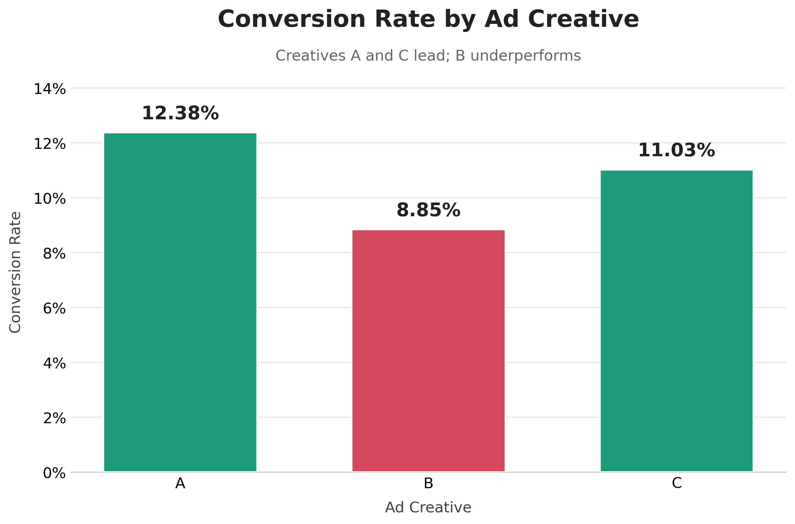
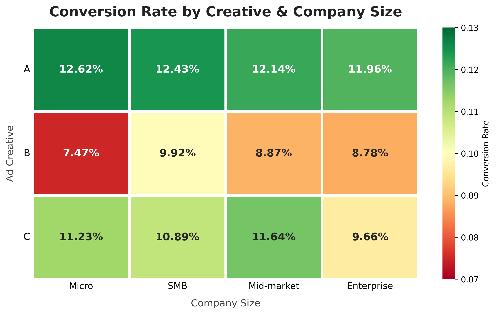

# 📊 TalentFlow — A/B Testing Ad Creative Performance

> Which ad creative wins the customer-acquisition battle — and can we *prove* it isn't just luck?


---

## TL;DR

I analyzed a **10,000-customer A/B test** of three ad creatives for *TalentFlow*, a recruitment SaaS, to find which creative drives the highest conversion — and validated the result with statistical testing rather than eyeballing a bar chart.

**Bottom line:** **Creative A is the winner** at **12.38%** conversion, leading in *every* company-size segment. **Creative C is a close, statistically-equivalent second (11.03%)**, making it a safe scaling alternative. **Creative B (8.85%) significantly underperforms and should be retired.**

| Creative | Conversion | Verdict |
|:--------:|:----------:|:--------|
| 🟢 **A** | **12.38%** | **Scale — top performer, wins every segment** |
| 🟢 **C** | 11.03% | Scale — statistically tied with A |
| 🔴 **B** | 8.85% | Retire — significantly worse than both |

---

## 🎯 The Business Question

For a growing recruitment SaaS, **a few percentage points of conversion is worth millions** across the acquisition funnel. The marketing team ran three ad creatives and needed to know:

1. Which creative converts best **overall**?
2. Does the winner hold up **across company sizes** (Micro → Enterprise)?
3. Are the differences **real, or just random noise**?
4. Which creative attracts **higher-value** customers (by ARR)?

The three creatives tested distinct value propositions:

| Creative | Hook | Angle |
|:--------:|:-----|:------|
| **A** | *"Hire Faster"* | Speed, automation, lower time-to-hire |
| **B** | *"Hire Better"* | Candidate quality, cultural fit |
| **C** | *"Scale Your Hiring"* | Infrastructure for growing teams |

---

## 🔑 Key Findings

### 1. Creative A wins overall — and convincingly beats B



Creative A converts at **12.38%** vs Creative B's **8.85%** — a **3.53 percentage-point gap**, or a **40% relative uplift**. Creative C sits just behind A at **11.03%**.

### 2. A's dominance holds across *every* segment



From Micro to Enterprise, the ranking is consistent: **A ≥ C > B in all four segments.** No company size rescues Creative B — it's the weakest performer everywhere (dipping to **7.47%** for Micro accounts).

### 3. The differences are statistically real — with one important nuance

A chi-square test confirms creative choice genuinely affects conversion (**p < 0.001**). Post-hoc pairwise tests (Bonferroni-corrected) reveal the nuance:

| Comparison | p-value | Significant? | Interpretation |
|:-----------|:-------:|:------------:|:---------------|
| **A vs B** | 0.000004 | ✅ Yes | A beats B decisively |
| **B vs C** | 0.003186 | ✅ Yes | C also beats B |
| **A vs C** | 0.092587 | ❌ No | A's lead over C is *not* statistically significant |

**What this means:** Creative A is the clear practical winner — highest conversion overall and in every segment — but because A's edge over C isn't statistically significant, **C is a validated, low-risk alternative** rather than a distant runner-up. Both decisively outperform B.

---

## 💡 Recommendation

> **Scale A as the primary creative. Keep C as a proven alternative. Retire B.**

- **Lead with Creative A** — it posts the highest conversion overall and in all four segments.
- **Keep Creative C in rotation** — statistically tied with A, so it de-risks creative fatigue and gives a second strong asset to scale.
- **Retire Creative B immediately** — significantly worse than both A and C; reallocate its budget to an A/C split.
- **Creative post-mortem** — study the shared hooks in A and C ("speed" + "scale") that beat B's "quality" angle to guide the next design sprint.

---

## 🛠️ How I Built It

| Stage | Tooling | What I did |
|:------|:--------|:-----------|
| **Data** | Python (`pandas`, `numpy`) | Generated a realistic 10K-customer synthetic dataset across 4 relational tables |
| **Storage** | MySQL | Designed schema, loaded data, queried with multi-table joins |
| **Analysis** | SQL | Segmented conversion + ARR by creative and company size |
| **Validation** | Python (`SciPy`) | Chi-square test of independence + Bonferroni-corrected pairwise comparisons |
| **Visualization** | `matplotlib`, `seaborn` | Conversion bar chart + creative × segment heatmap |

**Skills demonstrated:** SQL (joins, aggregation, segmentation) · statistical hypothesis testing · Python data analysis · data visualization · translating analysis into business recommendations.

---

## 📁 Repository Structure

```
TalentFlow_AbTest/
├── README.md                          ← you are here
├── DOCUMENTATION.md                   ← full methodology, queries & results
├── data/                              ← synthetic dataset (4 CSV tables)
├── sql/
│   ├── talentflow_schema.sql          ← table definitions
│   ├── load_data.sql                  ← data load script
│   └── talentflow_sql_queries.md      ← analysis queries
├── notebooks/
│   └── Talent_Flow_Statistics.ipynb   ← statistical testing
├── visuals/                           ← generated charts
├── screenshots/                       ← query-execution proof
└── talentflow_synthetic_data_generator.py
```

---

## ▶️ Reproduce It

```bash
# 1. Generate the synthetic dataset
python talentflow_synthetic_data_generator.py

# 2. Create schema and load data (MySQL)
mysql -u root -p talentflow < sql/talentflow_schema.sql
mysql -u root -p talentflow < sql/load_data.sql

# 3. Run the statistical analysis
jupyter notebook notebooks/Talent_Flow_Statistics.ipynb
```

---

## ⚠️ Note on the Data

This project uses a **synthetic dataset** built for portfolio demonstration, with parameters grounded in real SaaS benchmarks (conversion ranges, churn by company size, ARR tiers). It showcases the analytical workflow end-to-end; the numbers are illustrative, not from a live campaign.

---

*Built by Tal Lezerovich — data analysis portfolio. Full methodology in [DOCUMENTATION.md](DOCUMENTATION.md).*
